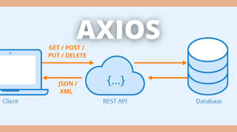

# Что такое AXIOS в js

Axios - это библиотека JavaScript, которая позволяет делать HTTP-запросы из браузера или из Node.js. Она предоставляет простой и удобный интерфейс для выполнения запросов на сервер и обработки ответов. Axios поддерживает множество методов запросов, включая GET, POST, PUT, DELETE и другие. Он также поддерживает загрузку и отправку файлов, установку заголовков запроса и многое другое. Axios является одним из наиболее популярных инструментов для работы с HTTP-запросами в JavaScript.

Для сетевых запросов и обработки ответов существует и встроенный современный метод fetch. Axios и fetch, предоставляют возможность делать HTTP-запросы из JavaScript. Однако, Axios имеет несколько преимуществ.

# Методи AXIOS

* Метод Post :

* Метод Post :

* Метод Get :

# Основы Event Loop в JavaScript

 В JS Event Loop позволяет непрерывно проверять, есть ли в очереди задачи, и, когда стек вызовов пуст, передавать эти задачи на выполнение.

 Таким образом долгие операции, например, запросы к серверу или таймеры, не мешают продолжению выполнения кода. Именно благодаря Event Loop приложение может оставаться отзывчивым, позволяя юзерам продолжать взаимодействие с интерфейсом, пока в фоне выполняются тяжелые задачи.

 